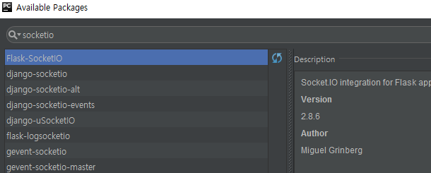

초기 아이디어
1. 결제시스템 + 홈쇼핑
2. 무난한 전화번호부
3. 웹게임
4. 오픈허브 예약시스템

주제 : 오픈허브 예약시스템

#  오픈허브 예약시스템

## 실행 방법

저희 프로젝트는 파이썬 2.7 버전에서 돌아가도록 만들었습니다.

### 1 프로젝트 클론받기

### 2 pycharm 에서 열기

### 3 virtual env 만들기

조교님의 컴퓨터는 소중하니까 env하나 만들어주세요

### 4 모듈 받기

flask ver: 0.12.2
Flask-SocketIO ver: 2.8.6

### 5 실행 완료

flaskr을 실행합니다!

